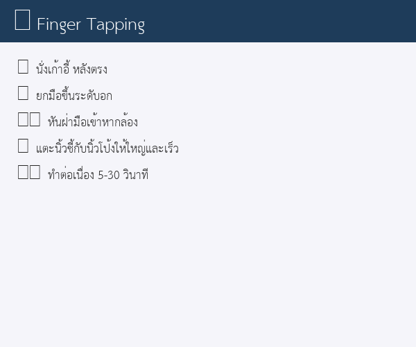
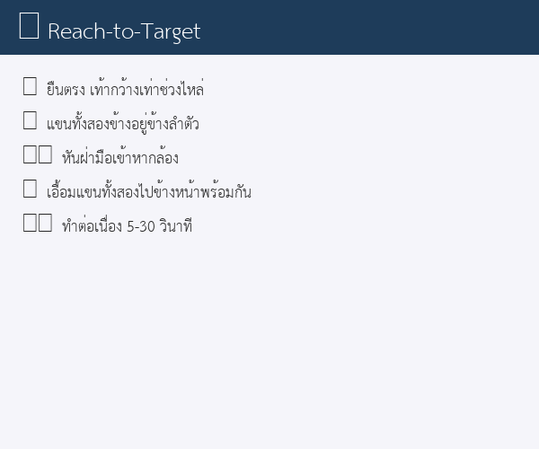
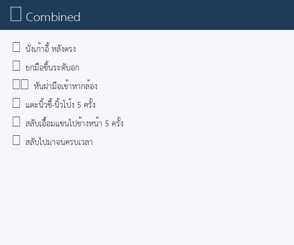

# Hand Assessment AI for Elderly Rehabilitation

> **AI Vibe Coding: Digital Aiding 4 Aging Hackathon 2026**
> จัดโดย หน่วยบ่มเพาะนวัตกรปัญญาประดิษฐ์ (AI Incubator)
> **มหาวิทยาลัยเทคโนโลยีราชมงคลล้านนา น่าน (RMUTL Nan)**
>
> โครงการแข่งขันพัฒนาแอปพลิเคชันและนวัตกรรมด้านสุขภาพสำหรับผู้สูงอายุ
> ร่วมกับ สำนักงานพัฒนาวิทยาศาสตร์และเทคโนโลยีแห่งชาติ (สวทช.)

วิเคราะห์การเคลื่อนไหวของมือจากวิดีโอเพื่อตรวจสอบ **ความถนัด (Hand Dominance)** และ **ภาวะ Learned Non-Use** ในผู้สูงอายุ โดยใช้ MediaPipe Hand Landmarker + Machine Learning

## Features

- **📹 Upload Video** — อัปโหลดวิดีโอการเคลื่อนไหวมือเพื่อวิเคราะห์
- **📷 Webcam (Live)** — บันทึกและวิเคราะห์แบบ Real-time
- **📊 3 Pillars Assessment** — วัด Speed / Accuracy / Quality of Movement
- **🔄 Symmetry Analysis** — เปรียบเทียบ Left vs Right hand
- **⚠️ Learned Non-Use Detection** — แยกแยะ Natural Dominance vs LNU

## Tech Stack

| Component | Technology |
|-----------|-----------|
| Python 3.10+ | Core language |
| OpenCV | Video processing |
| MediaPipe Hand Landmarker | 21-point hand tracking |
| NumPy / SciPy | Signal processing, kinematics |
| scikit-learn | Classification |
| Streamlit | Web UI |

## Pipeline

```
Input (video/webcam) → OpenCV → MediaPipe (21 landmarks)
  → Feature Extraction (Speed / Accuracy / Quality)
    → Symmetry Index → Classification
      → Output: Dominance + Learned Non-Use Risk
```

## Installation

```bash
# Clone
git clone https://github.com/thanithpol/ai-vibe-coding-digital-aiding-4-aging-hackathon.git
cd ai-vibe-coding-digital-aiding-4-aging-hackathon

# Install dependencies
pip install -r requirements.txt

# Run
streamlit run src/app.py
```

## Usage

1. เลือก **Upload Video** หรือ **Webcam (Live)**
2. เลือก **Test Type** (Finger Tapping / Reach-to-Target / Combined)
3. ตั้งค่า **Recording Duration** (5-30 วินาที)
4. รอผลการวิเคราะห์

## แบบทดสอบ (Exercise Guides)

### 👆 Finger Tapping (แตะนิ้ว)



| ขั้นตอน | คำอธิบาย |
|---------|---------|
| 🪑 ท่าทาง | นั่งเก้าอี้ หลังตรง มือระดับอก |
| 🖐️ การวางมือ | หันฝ่ามือเข้าหากล้อง |
| 👆 การเคลื่อนไหว | แตะนิ้วชี้กับนิ้วโป้งให้ใหญ่และเร็วที่สุด |
| ⏱️ ระยะเวลา | ทำต่อเนื่องตามที่ตั้งค่า (5-30 วินาที) |
| ✅ เป้าหมาย | วัดความเร็ว (Speed) และความสม่ำเสมอ (Regularity) ของการแตะ |

### 🏃 Reach-to-Target (เอื้อมแขน)



| ขั้นตอน | คำอธิบาย |
|---------|---------|
| 🧍 ท่าทาง | ยืนตรง เท้ากว้างเท่าช่วงไหล่ |
| 🤲 การวางมือ | แขนทั้งสองข้างอยู่ข้างลำตัว หันฝ่ามือเข้าหากล้อง |
| 🏃 การเคลื่อนไหว | เอื้อมแขนทั้งสองข้างไปข้างหน้าพร้อมกัน |
| ⏱️ ระยะเวลา | ทำต่อเนื่องตามที่ตั้งค่า (5-30 วินาที) |
| ✅ เป้าหมาย | วัดระยะเอื้อม (Range of Motion) และความลื่นไหล (Smoothness) |

### 🔄 Combined (ผสมทั้งสอง)



| ขั้นตอน | คำอธิบาย |
|---------|---------|
| 🪑 ท่าทาง | นั่งเก้าอี้ หลังตรง |
| 🤲 การวางมือ | ยกมือขึ้นระดับอก หันฝ่ามือเข้าหากล้อง |
| 👆🏃 การเคลื่อนไหว | สลับแตะนิ้ว 5 ครั้ง → เอื้อมแขน 5 ครั้ง → ทำซ้ำ |
| ⏱️ ระยะเวลา | ทำต่อเนื่องตามที่ตั้งค่า (5-30 วินาที) |
| ✅ เป้าหมาย | ทดสอบการสลับการเคลื่อนไหว (Task Switching) |

### 💡 เคล็ดลับเพื่อผลลัพธ์ที่ดีที่สุด

- 🪑 นั่งหลังตรง มือระดับอก
- 📏 ห่างกล้องประมาณ 50 ซม.
- 🖐️ หันฝ่ามือเข้าหากล้องตลอดเวลา
- ☀️ แสงสว่างเพียงพอ = ตรวจจับดีขึ้น
- ⌚ ถอดนาฬิกา แหวน ถุงมือ
- 👆 แตะนิ้วให้ใหญ่และเร็ว
- 🔄 ซ้าย/ขวาบนจอ = ตรงข้ามกับมือจริง (ภาพจากกล้องจะกลับด้าน)

## Project Structure

```
├── assets/
│   ├── fonts/             # Thai font (THSarabunNew.ttf)
│   ├── recordings/        # Session recordings (auto-generated)
│   │   └── sessions/      # Patient session JSON data
│   ├── *.mp4              # Video resources for testing
│   └── hand_landmarker.task  # MediaPipe model (auto-downloaded)
├── docs/
│   ├── Research/          # Obsidian vault (notes, analysis, docs)
│   ├── SUMMARY.md         # Project summary
│   └── แข่งขัน E-Health Hackathon 2026 Elderly AI Innovation.pdf
├── logs/                  # App logs (auto-generated)
├── src/
│   ├── app.py             # Streamlit UI
│   ├── hand_tracker.py    # MediaPipe hand detection
│   ├── features.py        # Speed/Accuracy/Quality feature extraction
│   ├── classifier.py      # Dominance + LNU classification
│   ├── config.py          # Constants, dataclasses, thresholds
│   ├── session.py         # Patient session persistence
│   ├── report.py          # PDF report generation
│   ├── logger.py          # Structured logging setup
│   ├── guidance.py        # In-frame exercise guidance overlay
│   ├── yolo_detector.py   # YOLO person validation
│   ├── live_analysis.py   # CLI real-time analysis
│   └── run_analysis.py    # Batch video analysis
├── tests/
│   ├── test_config.py
│   ├── test_classifier.py
│   ├── test_features.py
│   └── test_session.py
├── Dockerfile
├── docker-compose.yml
├── requirements.txt
└── README.md
```

## Video Demo

ส่งภายใน **24 มิ.ย. 69 เวลา 09:00 น.** ที่ https://forms.gle/sAzY9AK7Lj1wXHkq6

## Team

**AI Vibe Coding** — Digital Aiding 4 Aging Hackathon 2026
มหาวิทยาลัยเทคโนโลยีราชมงคลล้านนา น่าน (RMUTL Nan)

---

*โปรเจกต์นี้เป็นส่วนหนึ่งของการแข่งขัน AI Vibe Coding: Digital Aiding 4 Aging Hackathon 2026 จัดโดย AI Incubator — RMUTL น่าน*
